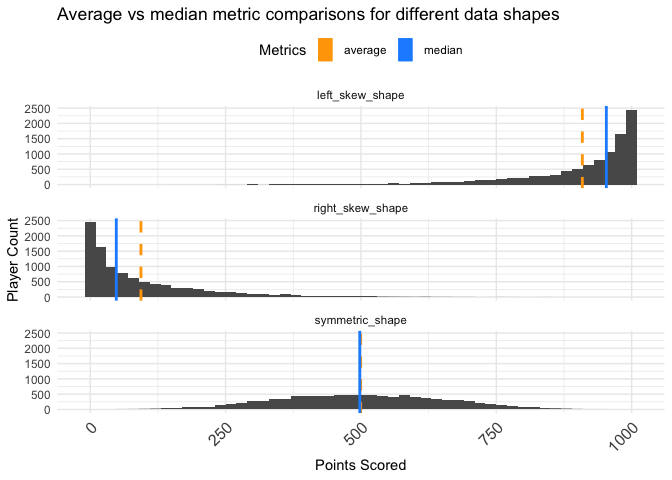

Average vs Median comparison
================

### Notebook objective

  - Generate visualizations to show non-technical stakeholders how an
    underlying data distribution influence an average or median metric

### Metrics

  - Median: find the middle point (50th percentile) in a set of numbers
  - Average: add a set of numbers up then divide by the length of the
    set

### Generate example data

  - Simulated data for illustration purposes only
  - Fake data for 3 different video games

<!-- end list -->

``` r
library(tidyverse)
library(kableExtra)

### generate example data
left_long_tail <- tibble(label="left_skew_shape",
                         nums = rbeta(10000,5,0.5)*1000) %>%
  mutate(avg = mean(nums),
         median = median(nums))

right_long_tail <- tibble(label="right_skew_shape",
                          nums = rbeta(10000,0.5,5)*1000) %>%
  mutate(avg = mean(nums),
         median = median(nums))

similar_tails  <- tibble(label="symmetric_shape",
                         nums = rbeta(10000,5,5)*1000) %>%
  mutate(avg = mean(nums),
         median = median(nums))

example_data <- bind_rows(list(left_long_tail, 
                               right_long_tail, 
                               similar_tails))
```

### Takeways

  - Compared to the median, the average is pulled toward the tail of the
    underlying distribution
  - When the underlying distribution has a symmetric shape then average
    and median will land close together
  - When the average is considerably less than the median it hints at a
    left skew data shape
  - When the average is considerably larger than the median it hints at
    a right skew data shape

<!-- end list -->

``` r
example_data %>%
  ggplot(aes(x=nums)) +
  geom_histogram(binwidth=20) +
  geom_vline(aes(xintercept=avg, color="average"), linetype = "dashed", size=1) +
  geom_vline(aes(xintercept=median, color="median"), size=1) +
  facet_wrap(. ~ label, ncol=1) +
  labs(title="Average vs median metric comparisons for different data shapes",
       y="Player Count",
       x="Points Scored") +
  scale_color_manual(name = "Metrics", values = c(median = "dodgerblue", average = "orange")) +
  theme_minimal() +
  theme(axis.text.x = element_text(angle = 45, hjust = 1, vjust = 1, size=12),
        legend.position = "top",
        legend.title.align = 0.5)  + 
  guides(color = guide_legend(override.aes = list(size=5)))
```

<!-- -->

``` r
example_data %>%
      group_by(dataset_label = label) %>%
      summarise(average_points_scored = round(mean(nums),0),
                median_points_scored = round(median(nums),0)) %>%
      kbl() %>%
      kable_classic(full_width = F, html_font = "Cambria")
```

<table class=" lightable-classic" style="font-family: Cambria; width: auto !important; margin-left: auto; margin-right: auto;">

<thead>

<tr>

<th style="text-align:left;">

dataset\_label

</th>

<th style="text-align:right;">

average\_points\_scored

</th>

<th style="text-align:right;">

median\_points\_scored

</th>

</tr>

</thead>

<tbody>

<tr>

<td style="text-align:left;">

left\_skew\_shape

</td>

<td style="text-align:right;">

909

</td>

<td style="text-align:right;">

953

</td>

</tr>

<tr>

<td style="text-align:left;">

right\_skew\_shape

</td>

<td style="text-align:right;">

94

</td>

<td style="text-align:right;">

48

</td>

</tr>

<tr>

<td style="text-align:left;">

symmetric\_shape

</td>

<td style="text-align:right;">

499

</td>

<td style="text-align:right;">

498

</td>

</tr>

</tbody>

</table>
